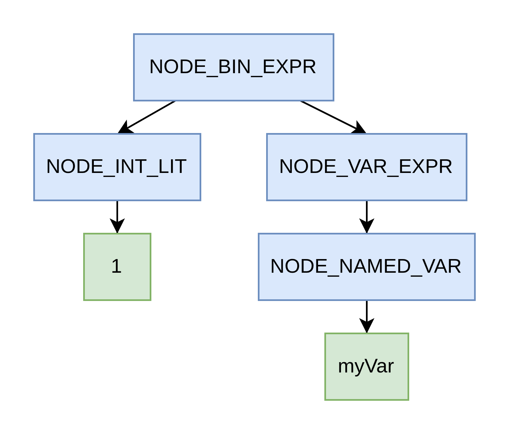
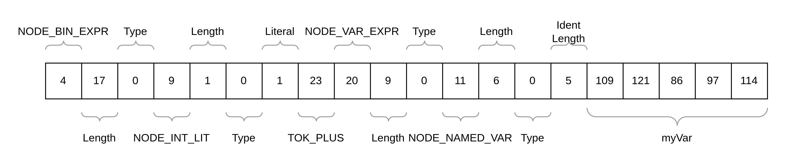

# Self-hosted SPL Compiler

This repository contains the source code of a self-hosted compiler for the [Simple Programming Language (SPL)](https://github.com/oskar2517/spl-compiler). 

## SPL

As its name suggests, SPL is a very simple programming language that provides only the most fundamental features. It includes procedures but no functions, supports reference parameters, allows local variables and stack-allocated arrays, and permits global type definitions. SPL uses a nominal type system, meaning two types are considered equal only when they originate from the exact same type definition. Notably, it lacks native support for strings, record types, or any form of heap-allocated data structure.

## Example

```
type PrimesArray = array[999999] of int;

proc sieveOfEratosthenes(n: int, ref primes: PrimesArray) {
    var i: int;
    var p: int;
    var j: int;
    
    i := 0;
    while (i < 999999) {
        primes[i] := 1;
        i := i + 1;
    }

    p := 2;
    while (p * p <= n) {
        if (primes[p] = 1) {
            j := p * p;
            while (j <= n) {
                primes[j] := 0;
                j := j + p;
            }

        }

        p := p + 1;
    }
}

proc main() {
    var primes: PrimesArray;

    sieveOfEratosthenes(999998, primes);
}
```

## Bootstrapping

The compiler was originally bootstrapped from an [implementation written in Java](https://github.com/oskar2517/spl-compiler). It produces x86 assembly for the [Netwide Assembler (NASM)](https://www.nasm.us/) and follows the [System V AMD64 ABI](https://wiki.osdev.org/System_V_ABI) calling convention, which should make it compatible with most Unix-like operating systems, although I have only tested it on Linux. The language's minimalist [standard library](https://github.com/oskar2517/spl-compiler/blob/main/std/x86/stdlib.c) is implemented in C and linked against the object file produced by NASM.

## Implementation

While implementing this compiler, I had to work within the limitations outlined above. I extensively used the C preprocessor to make development a bit less painful.

### I/O

SPL's standard library offers no procedures for interacting with the file system. The only way to supply external data to a program is via the built-in `readc` and `readi` procedures, which read a single character or integer respectively from standard input and store it in the provided reference parameter. As a result, input must be piped into the compiler, and a `NULL` character (`\x00`) is used to mark the end of the input stream.

Likewise, the compiler cannot write the generated assembly directly to a file. Instead, it outputs the assembly code to standard output using the `printc` and `printi` procedures. To obtain a file suitable for NASM, this output can simply be redirected to a file.

### The Lexer

The lexer breaks the input source code into tokens, each representing the smallest syntactic elements of the language's grammar, and stores them sequentially in an array. Every token contains at least one integer indicating its type, optionally followed by a literal value or lexeme. For example, given the input `proc main() { var test: int; }`, the lexer would produce the following tokens:

- Keyword `proc`
- Identifier `main`
- Left parenthesis
- Right parenthesis
- Left curly brace
- Keyword `var`
- Identifier `test`
- Colon
- Identifier `int`
- Semicolon
- Right curly brace

Most tokens can be represented by a single integer indicating their type, since they carry no additional data and the lexer does not record token positions. Only a few token types, namely integer literals, character literals, and identifiers, require an accompanying payload that reflects the actual value read from the source. For integer and character literals, this simply means converting the value to its integer form and storing it immediately after the token type in the token array. For identifiers, the lexer stores the identifier's length followed by the integer representation of each character.

The definitions shown below represent the tokens recognized in this example.
```
#define TOK_IDENT    0
...
#define TOK_PROC     7
...
#define TOK_VAR      10
#define TOK_LPAREN   11
#define TOK_RPAREN   12
...
#define TOK_LCURL    15
#define TOK_RCURL    16
...
#define TOK_COLON    27
#define TOK_SEMIC    28
```

## The Parser

This compiler uses a recursive-descent parser to transform the token array produced by the lexer into a syntax tree, which is then consumed by later compilation stages. Because SPL has neither record types nor heap allocation, the resulting abstract syntax tree (AST) must also be stored entirely within an array. To achieve this, the same general encoding strategy used by the lexer is applied.

Each node begins with a header indicating its type, followed by a value specifying the size of its payload. For certain nodes, such as all expression nodes, an additional empty slot is reserved immediately following the payload-length field; this slot will later store a reference to the node's data type, determined during semantic analysis. A node's payload may itself contain nested nodes as well as other relevant information. The payload-length value makes it easy to skip over any node in the array. 

For example, given the expression `1 + myVar`, at a high level, the parser would construct the following syntax tree:



Using the following definitions of node types, the tree would be represented as shown below in the nodes array:



```
...
#define NODE_BIN_EXPR        4
...
#define NODE_INT_LIT         9
...
#define NODE_NAMED_VAR       11
...
#define NODE_VAR_EXPR        20
...
```

## Name Analysis

During name analysis, the compiler gathers information about all defined data types, procedures, and variables declared within each procedure. This information is stored in symbol tables for later lookup. SPL uses only two levels of symbol tables: a global table and a per-procedure table (since variables must be declared at the beginning of a procedure).

To implement this, the compiler maintains a dedicated array containing all symbol-table entries in sequence. It also creates a set of hash maps (again, implemented using arrays) each representing one symbol table and stores these maps in another array. The first hash map corresponds to the global symbol table, and each subsequent map represents the local table of a single procedure. Storing a symbol then involves writing its entry into the symbol-table-entries array (where each entry again begins with the entry type, followed by its payload) and then recording the symbol's name in the appropriate hash map with a value equal to the index of that entry.

For example, a procedure entry holds the index of its local symbol table in the symbol-tables array, its parameter count, and references to the types of its parameters as well as information determined during the allocation phase. Those type entries are also stored in the symbol-table-entries array.

The following code shows how the symbol table entry for the builtin `printi` procedure is created:

```
// printi(i: int)
keyBuf[0] := 'p';
keyBuf[1] := 'r';
keyBuf[2] := 'i';
keyBuf[3] := 'n';
keyBuf[4] := 't';
keyBuf[5] := 'i';

hashmap_put_str(table, keyBuf, 6, entryPointer);  

ENTRIES_W(SYM_TAB_ENTRY_PROC)
ENTRIES_W(-1) // Symbol table of procedure (-1 for builtin)
ENTRIES_W(1) // One parameter
ENTRIES_W(0) // Parameter is not reference
ENTRIES_W(REG_RDI) // Position of parameter 1
ENTRIES_W(0) // Offset is zero for parameters passed by register
ENTRIES_W(SPL_TYPE_REF)
ENTRIES_W(SPL_TYPE_INT_INDEX)
ENTRIES_W(0) // Local Variable Area Size
ENTRIES_W(0) // Argument Area Size
ENTRIES_W(0) // Outgoing Area Size
```

Note the presence of the `SPL_TYPE_REF` type. These are required to support SPL's nominal type system. An `SPL_TYPE_REF` is followed by an index into the symbol-table-entries array and is transparently resolved to the entry it references. More details on this later.

## Semantic Analysis

During semantic analysis, the compiler verifies that the program is well-typed and that all referenced symbols have been defined. To do this, it traverses the syntax tree once more, initializing the extra type slot reserved in certain AST nodes.

Type checking the binary expression introduced in the parser section involves recursively determining the types of its subexpressions. At the lowest level of recursion, the left- and right-hand sides are the integer literal `1` and the named variable `myVar`. The type of the integer literal is straightforward: the compiler writes the symbol-table index of the integer type into its type slot. Determining the type of `myVar` requires looking it up in the current procedure's symbol table, retrieving the index of its declared type, and storing that index in the variable node's type slot; this value then propagates upward to the variable expression node.

When the recursion returns to the binary-expression node, the compiler checks whether both subexpressions are of type integer. If they are, it assigns the binary expression's own type slot the same integer-type reference. If not, a type-mismatch error is reported and compilation terminates.

This is where the previously mentioned `SPL_TYPE_REF` entries become useful. The `resolve_type_ref` procedure takes the index of a type entry in the symbol-table-entries array and transitively resolves any type references it encounters. It then writes the fully resolved index to the return parameter.

Comparing two types is therefore straightforward: after resolution, the compiler simply checks whether both types point to the same entry in the symbol-table-entries array. If they reference the same entry, the types are equal; if not, they differ.

```
proc resolve_type_ref(typeIndex: int, ref entries: DataArray, ref r: int) {
    if (entries[typeIndex] = SPL_TYPE_REF) {
        resolve_type_ref(entries[typeIndex + 1], entries, r);
    } else {
        r := typeIndex;
    }
}

proc compare_types(left: int, right: int, ref entries: DataArray) {
    var leftResolved: int;
    var rightResolved: int;

    resolve_type_ref(left, entries, leftResolved);
    resolve_type_ref(right, entries, rightResolved);

    if (leftResolved # rightResolved) {
        PC('E', 'r', 'r', 'o', 'r', ':', ' ', 'T', 'y', 'p', 'e', ' ', 'm', 'i', 's', 'm', 'a', 't', 'c', 'h', ' ', '(')
        print_type(entries, leftResolved);
        PC(',', ' ')
        print_type(entries, rightResolved);
        PC(')', '\n')
        exit(); // SEMANTIC ERROR: Type mismatch
    }
}
```

## Allocation

During the allocation phase, the compiler determines the stack‐frame size required for each procedure. This size consists of the memory needed for the procedure's local variables plus any additional space needed for passing arguments in procedure calls within the procedure body. According to the System V calling convention, the first six arguments of a call are passed in specific registers, while any remaining arguments must be placed on the stack.

As a result, every procedure call inside the procedure must be inspected, and the required outgoing stack space is determined by the call that uses the largest number of stack-passed arguments. Note that this outgoing area is allocated only if at least one call passes more than six arguments. The computed outgoing area sizes are then recorded in the corresponding fields of the procedure's symbol-table entry.

In addition, the stack offsets for variables and procedure parameters are computed and stored in their respective symbol-table entries.

## Code Generation

The code generator then traverses the syntax tree once more, emitting the assembly-level instructions needed to implement the behavior of each node. It relies on all information gathered during earlier compilation phases to produce code that faithfully executes the programmer's intent.